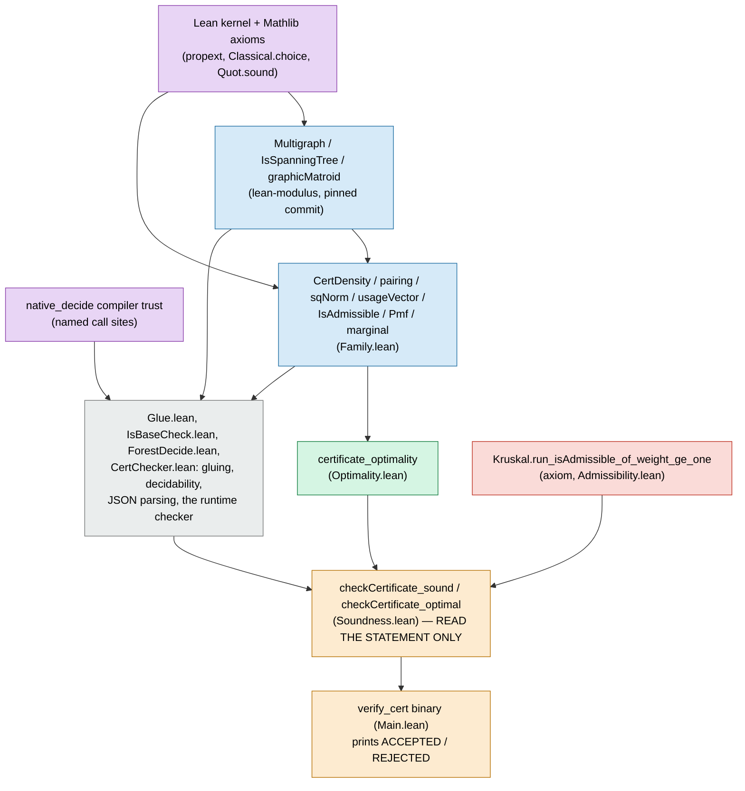

# What you need to read to trust `ACCEPTED`

[`pipeline.md`](pipeline.md) explains how the verifier is *built*. This file
answers a narrower question: if you didn't write any of this and don't
want to take it on faith, what is the actual, bounded reading list to
independently confirm that `ACCEPTED` means what it's claimed to mean?

The short answer: about 250 lines, out of roughly 3200 in `lean/` (plus
whatever `lean-modulus` contributes). Everything else in the verifier is
either kernel-checked bookkeeping you're entitled to skip once you trust
the kernel, or one of two explicitly named exceptions
([`trust.md`](trust.md)) that don't require reading any Lean at all to
understand.

This matters because "trust a proof" and "read a proof" are different
things. A Lean proof's *statement* is a claim in ordinary mathematical
English, translated into a type. Its *proof term* is what the kernel
checks. You always have to read the statement to know what was proved;
you never have to read the proof to know it's correct, that's the kernel's job. This document is about which statements to read.

## The claim, informally

Given a certificate JSON for a graph $G$, `ACCEPTED` is supposed to mean this:
there is a density $\rho$ on $G$'s edges and a probability distribution
$\mu$ on $G$'s spanning trees, both reconstructed from the certificate's
own data, such that $\rho$ has the smallest squared norm among *every*
admissible density on $G$ (it solves the modulus problem), and $\mu$'s
marginal $\eta$ has the smallest squared norm among the marginals of
*every* pmf on $G$'s spanning trees (it solves the dual problem).

Here are the steps to know that this is what `ACCEPTED` actually means, without reading the entire verifier.

## 1. Taken on faith, no Lean to read

- The Lean 4 kernel and Mathlib's axioms (`propext`, `Classical.choice`,
  `Quot.sound`). These are standard, unavoidable for any Lean proof.
- `native_decide`'s compiler trust, at the specific named call sites
  listed in [`trust.md`](trust.md). Essentially this means that you trust Lean's compiler to produce correct native code for certain decidable propositions.
- `Admissibility.lean`'s `Kruskal.run_isAdmissible_of_weight_ge_one`. This is an
  explicit `axiom` expressing an explicit gap in the proof; see
  [`trust.md`](trust.md) for what it would take to close it, and why a *uniform*
  `rho` (like the house example's) never needs it.

These are exactly the rows [`trust.md`](trust.md)'s ledger marks with
something other than a plain "yes, by construction".

## 2. Definitions to sanity-check (no proofs here)

This is the real formalization-adequacy risk. We're not asking "Is the proof
valid?" The trusted kernel proves that. Instead, we're asking "Does the
definition mean what a mathematician means by the same word?" All of it is short
enough to read directly.

From `lean-modulus` (`Common/GraphicMatroid.lean`, a pinned commit as described
in [`trust.md`](trust.md)): `Multigraph`, `IsSpanningTree`, `graphicMatroid`.
These aren't reproduced here; confirm for yourself that they mean "a graph with
possibly-parallel edges," "a spanning tree," and "the matroid whose independent
sets are the forests."

From [`Family.lean`](../../lean/DiscreteModulusCert/Family.lean) (the whole file is only ~150 lines):

| Lean | Meaning |
|---|---|
| `CertDensity E := E → ℚ` | A density: one rational number per edge. |
| `pairing f g := ∑ e, f e * g e` | The usual inner product. |
| `sqNorm f := ∑ e, f e ^ 2` | The squared Euclidean norm. |
| `usageVector T := T.indicator (fun _ => 1)` | The `{0,1}` vector that's `1` exactly on edges of `T`. |
| `IsAdmissible M ρ := ∀ T, M.IsBase T → 1 ≤ pairing ρ (usageVector T)` | $\rho$ is admissible: every base (spanning tree) has $\rho$-weight at least $1$. |
| `Pmf M` (structure) | A `Finset (Set E)` of bases (`support`), a weight function, proofs that every support element is a base, weights are nonnegative, and weights sum to `1`. |
| `Pmf.marginal μ e := ∑ T ∈ μ.support, μ.weight T * usageVector T e` | The expected edge usage $\eta = \mathcal N^T\mu$. |

`isAdmissible_graphicMatroid_iff` (bottom of `Family.lean`) is the simple
corollary identifying `IsAdmissible M` to "every spanning tree of $G$ has
$\rho$-weight $\ge 1$" when `M = G.graphicMatroid` and `G` is connected.

## 3. The one proof worth reading: `certificate_optimality`

[`Optimality.lean`](../../lean/DiscreteModulusCert/Optimality.lean)'s
`certificate_optimality`, and the two lemmas it composes, are short (~60
lines total) and mirror exactly the by-hand Cauchy-Schwarz argument in
[`pipeline.md`](pipeline.md#the-math-cauchy-schwarz-duality-optimalitylean):
if $\rho$ pairs against any admissible density's usage vector to at least
$1$ in expectation, then $1 \le \langle\rho,\eta\rangle \le
\|\rho\|\|\eta\|$, and equality forces $\rho = \eta/\|\eta\|^2$ to be
simultaneously optimal for both sides. Its signature:

```lean
theorem certificate_optimality {ρ : CertDensity E} (hρAdm : IsAdmissible M ρ)
    {μ : Pmf M} {η : E → ℚ} (hη : η = μ.marginal) (hηpos : sqNorm η ≠ 0)
    (hρeq : ρ = fun e => η e / sqNorm η) :
    (∀ ρ' : CertDensity E, IsAdmissible M ρ' → sqNorm ρ ≤ sqNorm ρ') ∧
      (∀ μ' : Pmf M, sqNorm η ≤ sqNorm μ'.marginal)
```

Mapping the hypotheses to the informal argument: `hρAdm` is "$\rho$
is admissible," `hη` names $\mu$'s marginal $\eta$, `hηpos` is "the
Cauchy-Schwarz equality case is non-degenerate," and `hρeq` is "$\rho$ and
$\eta$ are parallel unit-pairing vectors," which is exactly the equality
condition. The conclusion is the two-sided optimality claim from §1: this
is the theorem the whole pipeline exists to invoke.

This is a proof worth actually reading line by line, unlike everything
in §4 below — it's short, self-contained, and the whole soundness
argument's mathematical content lives here. Everything downstream is
connecting this theorem to a specific certificate's parsed data.

## 4. The capstone: read the statement, not the proof

[`Soundness.lean`](../../lean/DiscreteModulusCert/Soundness.lean)'s
`checkCertificate_optimal` (line 1144) is the theorem `lake exe
verify_cert` ultimately depends on:

```lean
theorem checkCertificate_optimal (raw : RawCertificate)
    (hok : checkCertificate raw = Except.ok ()) :
    ∃ (cg : CheckedGraph), buildGraph raw.graph = Except.ok cg ∧
      ∃ (declaredEta declaredRho : Array ℚ),
        parseRationalArray cg.endpoints.size raw.eta "eta" = Except.ok declaredEta ∧
        parseRationalArray cg.endpoints.size raw.rho "rho" = Except.ok declaredRho ∧
        ∃ (μ : Pmf cg.toMultigraph.graphicMatroid),
          (fun e : Fin cg.endpoints.size => declaredEta.getD e.val 0) = μ.marginal ∧
          (∀ ρ' : CertDensity (Fin cg.endpoints.size),
            IsAdmissible cg.toMultigraph.graphicMatroid ρ' →
              sqNorm (fun e : Fin cg.endpoints.size => declaredRho.getD e.val 0) ≤ sqNorm ρ') ∧
          (∀ μ' : Pmf cg.toMultigraph.graphicMatroid,
            sqNorm μ.marginal ≤ sqNorm μ'.marginal)
```

The hypothesis `hok` is exactly the runtime fact `Main.lean` checks before
printing `ACCEPTED`. The conclusion: `buildGraph raw.graph = Except.ok cg`
pins `cg` to be *the* graph the certificate's own `graph` field describes
(not just some graph with the right shape); the two `parseRationalArray`
equations pin `declaredEta`/`declaredRho` to be *the* certificate's own
parsed `eta`/`rho` fields; and given those, there's a genuine pmf `μ` on
`cg`'s spanning trees, with marginal exactly `declaredEta`, such that
`declaredRho` achieves the minimum `sqNorm` among *every* admissible
density on this graph, and `μ`'s marginal achieves the minimum `sqNorm`
among the marginals of *every* pmf on this graph's spanning trees. That's
precisely the informal claim from the top of this document.

**You do not need to read this theorem's proof** (`Soundness.lean` lines
1145–1160, plus the ~250 lines of `checkCertificate_sound`'s proof it
calls into, lines 956–1143). That's array-indexing and JSON-parsing
bookkeeping threading `checkCertificate`'s runtime computation through
`checkPieces_sound` and `certificate_optimality` (§3). None of that changes
what's proved; it only connects "the checker ran to completion" to "the
hypotheses of `certificate_optimality` hold for this specific data," which
the kernel has already verified regardless of whether a human re-derives
it. The entire human obligation at this step is reading the *signature*
above and confirming it says what §1 claims `ACCEPTED` means.

> [!WARNING]
> **This is not a hypothetical concern. An earlier version of this
> exact theorem got this wrong, and reading the statement carefully is what caught
> it.** The previous statement read `∃ (n m : Nat) (G : Multigraph (Fin n)
> (Fin m)) (ρ : CertDensity (Fin m)) (μ : Pmf G.graphicMatroid), (∀ ρ', ...)
> ∧ (∀ μ', ...)` That's an existential with *no equation anywhere* tying `n`,
> `m`, `G`, `ρ`, or `μ` back to `raw`. That statement is provable by a
> proof that ignores `raw`/`hok` entirely: fix a 2-vertex, 1-edge graph,
> `ρ = 1` on its one edge, and the pmf putting all its weight on that one
> spanning tree, and both conjuncts hold outright, regardless of which
> certificate was supposedly checked (this compiled and was verified
> directly against the kernel). The tell was already visible in
> `EndToEndTest.lean`: `house_end_to_end_optimal` and
> `nested_end_to_end_optimal` had *syntactically identical* types; nothing
> about "house" or "nested" appeared in either statement. The fix, above,
> exposes the `Except.ok` equations the proof already computed internally
> (via `checkQArrayEq_sound`, `Soundness.lean` line 312) instead of hiding
> them behind an unconstrained existential. The lesson generalizes: an
> existential conclusion that never equates its witnesses to anything in
> the hypothesis is a standing invitation to prove it with an unrelated
> fixed witness.

One thing worth checking that isn't a Lean question at all: does `cg` (as
built from `raw.graph` by `buildGraph`) actually match the graph you
intended to certify? That's a "does the JSON say what I think it says"
question, answered by [`schema.md`](schema.md), not by reading more Lean.

## 5. What this buys you

Restating [`trust.md`](trust.md)'s conclusion in this document's terms:
for a certificate whose `rho` is uniform (like `house`'s), `#print axioms
checkCertificate_optimal` on that instance shows only `propext`,
`Classical.choice`, `Quot.sound` — a fully kernel-checked proof with zero
project-specific trust beyond the definitions in §2. For a certificate
whose `rho` isn't uniform, the same holds with one addition:
`Kruskal.run_isAdmissible_of_weight_ge_one`, printed by name, and printed
unconditionally by `verify_cert` itself alongside every `ACCEPTED`.

## The reading list, concretely

In order, this is everything a skeptical reader needs — nothing in
`lean/` outside this list is required reading (it can be treated as
kernel-checked plumbing, or, for `native_decide` call sites, as the named
exception in §1):

1. `lean-modulus`'s `Multigraph` / `IsSpanningTree` / `graphicMatroid`
   definitions (pinned commit — see [`trust.md`](trust.md) for exactly
   which one).
2. [`Family.lean`](../../lean/DiscreteModulusCert/Family.lean) in full
   (~150 lines, all definitions and short lemmas, §2 above).
3. [`Optimality.lean`](../../lean/DiscreteModulusCert/Optimality.lean)'s
   `certificate_optimality` and its two halves (~60 lines, §3 above).
4. `Soundness.lean` lines 1124–1154 only — `checkCertificate_optimal`'s
   docstring and signature (§4 above). *Not* its proof, and not
   `checkCertificate_sound`'s.
5. `Admissibility.lean`'s `run_isAdmissible_of_weight_ge_one` axiom
   statement (~10 lines) plus [`trust.md`](trust.md)'s explanation of it.

That's on the order of 250–300 lines, regardless of how large the rest
of `lean/` or `lean-modulus` grows.

## Dependency / trust graph

Colors mark the same five categories used above, not import structure —
`ForestDecide.lean`'s BFS internals and `CertChecker.lean`'s JSON-parsing
details are real code but contribute no mathematical content, so they're
collapsed into one "kernel-checked plumbing" node rather than drawn file
by file.



Purple: trusted outright, no Lean to read. Blue: definitions to
sanity-check, no proofs. Green: the one proof worth reading end to end.
Grey: kernel-checked plumbing, safe to skip. Red: the one accepted gap,
absent entirely for a uniform `rho`. Orange: read the statement, skip the
proof.
